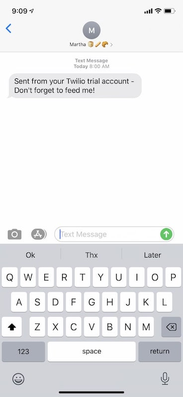

<h1 align="center">Create a Sourdough Starter Text Message Reminder with Azure's Timer Trigger Function and Twilio SMS</h1>

  
  

## Overview

> Sourdough bread is made with flour, water, and starter. Starter is a live wild yeast that's made out of flour, water, and air. Unfortunately, if starter is not fed (with water and flour) regularly, it will not activate and we won't be able to make bread. And if we neglect it long enough, then, it'll die. This app allows us to set up automatic text message reminders so we don't forget to feed our starter!

Language: JavaScript

Products: Azure Functions Timer Trigger, Visual Studio Code, Twilio SMS

## Features

- Text message reminders with custom message and timing using [Azure Timer Trigger](https://azure.microsoft.com/en-us/free/?http://WT.mc_id=breadsoph-github-chcondon) and [Twilio](https://www.twilio.com/referral/QYHnll)

## Prerequisites

### Sign up for Microsoft Azure account

We'll use a [free Azure subscription](https://azure.microsoft.com/en-us/free/?http://WT.mc_id=breadsoph-github-chcondon) to set up our Timer trigger function.

### Sign up for Twilio and get a phone number.

We'll use [Twilio's free trial](https://www.twilio.com/referral/QYHnll) so we can get a number and use Twilio's API to text ourselves.

### Download Visual Studio Code and the Azure Extension

We'll use the [Azure extension](https://code.visualstudio.com/docs/azure/extensions/?http://WT.mc_id=breadsoph-github-chcondon) in [Visual Studio Code](https://code.visualstudio.com/?http://WT.mc_id=breadsoph-github-chcondon) to create your function and deploy our code to our Azure portal.

## Tutorial

You can find a full tutorial on how to create this text message reminder app in my blog post, [So You Forgot to Feed Your Sourdough Starter Baby? 🍞👶](https://dev.to/sophia_wyl/so-you-forgot-to-feed-your-sourdough-starter-baby-1g8c)

## License

[MIT](https://github.com/sophi-li/sourdough-timer/blob/master/LICENSE)

## Author

👤 Sophia

- Twitter: [@sophia_wyl](https://twitter.com/sophia_wyl)
- GitHub: [@sophi-li](https://github.com/sophi-li)
